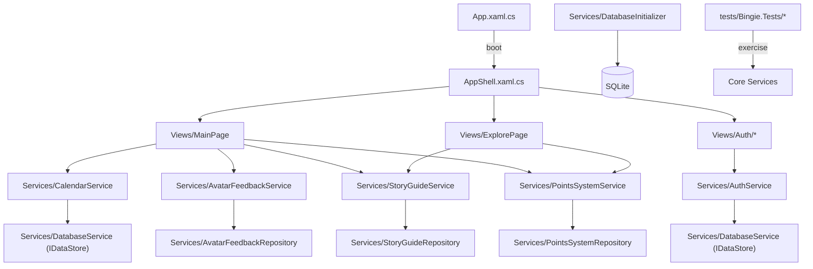

# Bingie Architecture Overview

## High-Level Flow
- The MAUI `App` class bootstraps logging, dependency injection, and the navigation shell.
- `AppShell` wires the navigation tabs (Home, History, Explore) and injects shared services into each page.
- Feature services (avatar feedback, story guide, points system) sit behind interfaces and data repositories; they read/write through SQLite via `DatabaseService`.
- UI pages call into services to fetch state, persist actions, and trigger feature-specific workflows, while feature flags in `FeatureFlags` gate optional experiences.

## Runtime Topology

## Key Components
- **UI Layer**: XAML pages under `Bingie/Views/` render gradients, forms, and dashboards. Pages keep logic minimal, delegating to injected services.
- **Services Layer**: `Bingie/Services/` houses domain logic (auth, calendar, avatar feedback, story guide, points). Each service coordinates repositories, enforces feature flags, and exposes async APIs to the UI.
- **Data Layer**: `DatabaseService`, feature repositories, and `DatabaseInitializer` provide SQLite persistence. Repositories encapsulate SQL schemas and data conversions.
- **Configuration**: `FeatureFlags` toggles optional modules via environment variables or test overrides.
- **Testing**: `tests/Bingie.Tests` exercises services with in-memory stores, covering happy paths, negative cases, and integrated flows like remember-me or points accrual.

Use this document as the orientation map when diving into the codebase or onboarding new contributors.
